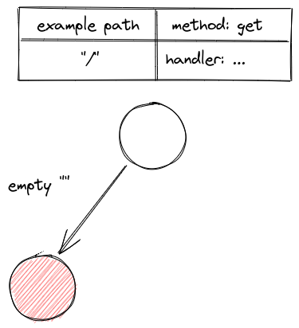
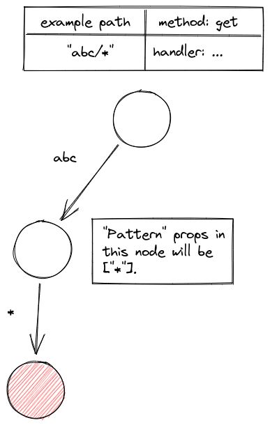

# Extra

26th July 2022 (12:57am Malaysia)

This markdown is about some special case in Hono

## "/" Route

When we add a **"/"** route. It will generate a node like this. (Only happen if we add exactly **/** )

## How is pattern begin store?

Pattern is store at the parentNode

Below is the example for **wildCard pattern** route.

### But why store in pattern?

So if we found a child with exact path, we can get it with `node.children[exactPath]`. At the same time we can get **wildcard & regexp**. By doing `children[ "*"]`or`children[pattern[0]]` (0 index is the key like `:name`)
