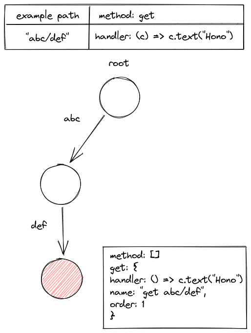

# Router

---

21st July 2022 (01:20am Malaysia)

Inside a Hono object, it owns a **TrieRouter**.

```ts
readonly router = new TrieRouter();
```

> Hono provide two router, **reg-exp & trie router**

Basically, the router is just a wrapper on top of a **Root Node**. Since it is using [Trie Data structure](https://en.wikipedia.org/wiki/Trie#:~:text=In%20computer%20science%2C%20a%20trie,key%2C%20but%20by%20individual%20characters.) So the concept of node does exist.

The router owns two method

1. add(method, path, handler)
   **Insert handler** & method into the DS based on **path**.
2. search(method, path)
   Search a **handler & params** from the DS.

# Node

---

When we init a Hono object, it actually owns and operate on a Trie (tree).

So Node actually is the **Main Resource** of this framework.

Before we go into what a node contain, I think it is better to understand what the **insert method** is doing. Do a top down approach

### Insert

params: method, path, handler

> Only brief through here... Not going details

1. Increase the `order` of the node.
2. split path by using `/\//` regex. (shift one if [0] === "")
3.

## How Trie begin build? (Split to other md)

> Assume we have only the root node, and no pattern like **:id**

1. When we do `app.get("abc/def", handler)`. It will construct a trie like this
   

2. The pointer `curNode` will stop at the last node (red color node).

3. All handler is stored in the last node of a path.

## What does a Node contain?

1. children
2. order (I think this is use to track number of node)
3. pattern (we will see what is this after this)

25 July 2022 (6:45pm Malaysia)

## Pattern

1. A route contain pattern only if the segment is **\*** or **:params{}**.
2. The `getPattern()` util function will return array of 3 if it is a named params. For example

```ts
const pattern = getPattern("/user/:id");
const pattern2 = getPattern("/user/:name{[a-zA-z]}");
// pattern --> [:id, id, true]
// pattern2 --> [:name, name, RegExp]
```
